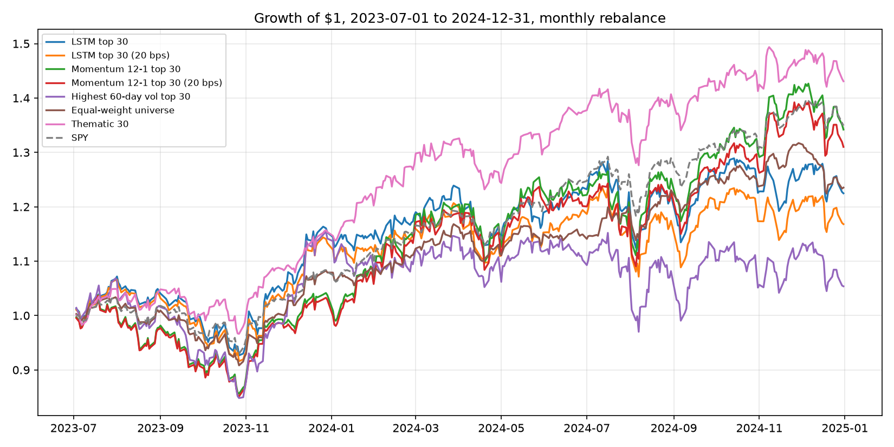
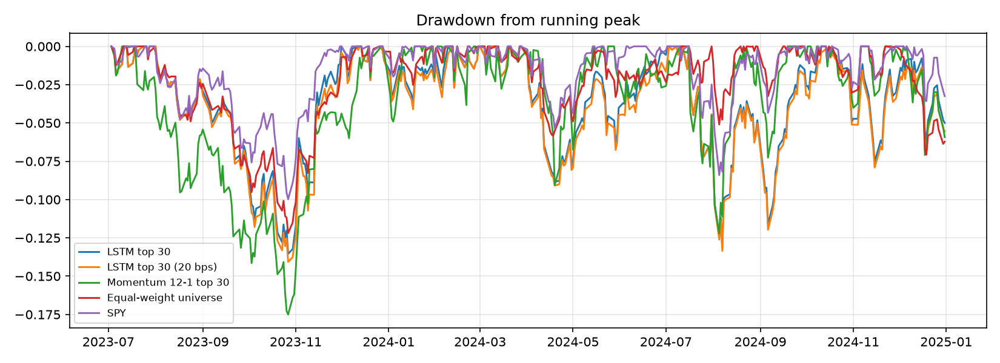
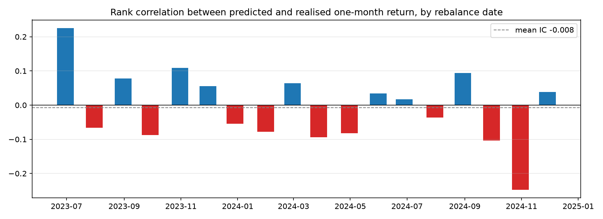
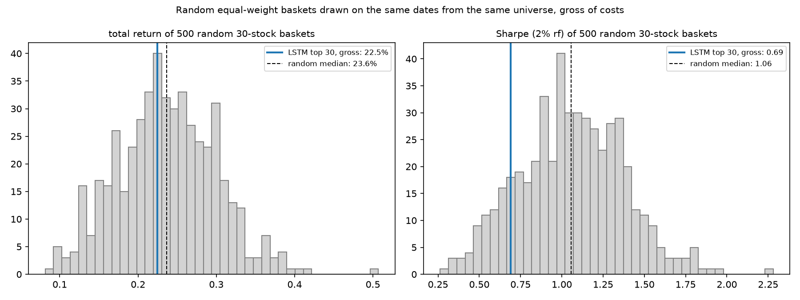

# S&P 500 LSTM stock selection, walk-forward backtest

Each month-end, one small LSTM per stock predicts the next month's return from the last 60 daily prices. The 30 highest-ranked stocks are held equal-weight for the following month. Models are retrained every six months on data up to that date only, so no prediction sees future prices; the universe on each date excludes companies that joined the index later (see Method and Limitations). The result is compared with the equal-weighted universe, a plain momentum ranking, two naive screens, SPY, a fixed 30-stock thematic list, and 500 random 30-stock baskets drawn on the same dates.

Short version of the findings: the LSTM basket returned 22.5% gross over 18 months against 23.5% for the equal-weight universe and 34.9% for SPY. Its ranking has no information content across the universe (mean IC -0.008), its Sharpe sits at the 13th percentile of random baskets, and a one-line momentum rule beat it by 12 points with half the turnover. The same strategy run on today's constituent list, without removing later additions, shows 52.8%; the difference is entirely names that were not in the index at the time. That gap is the most useful thing in this repository.

This is the second version of the project. The first version (kept in `legacy/main_v1.py`) trained once, made a single next-day forecast per stock and held the top 30 for 18 months with no costs. The changes here are the ones I would want to see before believing any backtest: rolling re-selection, transaction costs, a point-in-time universe, like-for-like benchmarks, and a test of whether the signal has any information at all.

## Results

Test window 2023-07-01 to 2024-12-31 (18 monthly rebalances). Constituent list as of September 2026 (479 names with enough price history), filtered on each rebalance date to the 441-454 names already in the index by then. One-month forecast horizon, 3 epochs per model, seed 0.

| Portfolio                    |   Cost (bps) | Total return   | Ann. return   | Ann. vol   |   Sharpe | Max drawdown   | Avg. turnover / rebalance   |
|:-----------------------------|-------------:|:---------------|:--------------|:-----------|---------:|:---------------|:----------------------------|
| LSTM top 30                  |            0 | 22.5%          | 14.5%         | 18.1%      |     0.69 | -13.5%         | 131.4%                      |
| LSTM top 30                  |            5 | 21.0%          | 13.6%         | 18.1%      |     0.64 | -13.7%         | 131.4%                      |
| LSTM top 30                  |           20 | 16.8%          | 10.9%         | 18.1%      |     0.49 | -14.1%         | 131.4%                      |
| Momentum 12-1 top 30         |            0 | 34.2%          | 21.7%         | 20.1%      |     0.98 | -17.5%         | 66.5%                       |
| Momentum 12-1 top 30         |           20 | 31.0%          | 19.7%         | 20.1%      |     0.88 | -17.8%         | 66.5%                       |
| Highest 60-day vol top 30    |            0 | 5.4%           | 3.6%          | 22.7%      |     0.07 | -20.6%         | 60.3%                       |
| Biggest 60-day losers top 30 |            0 | 10.0%          | 6.6%          | 17.4%      |     0.26 | -18.7%         | 109.2%                      |
| Equal-weight universe        |            0 | 23.5%          | 15.1%         | 11.7%      |     1.12 | -12.2%         | 10.4%                       |
| Equal-weight universe        |            5 | 23.4%          | 15.1%         | 11.7%      |     1.12 | -12.2%         | 10.4%                       |
| Thematic 30                  |            0 | 43.1%          | 27.0%         | 14.5%      |     1.72 | -9.9%          | 10.3%                       |
| SPY                          |            0 | 34.9%          | 22.1%         | 12.2%      |     1.64 | -10.0%         | 0.0%                        |

Costs are charged as basis points per dollar traded on each rebalance (5 bps is roughly institutional, 20 bps is a conservative retail assumption). Sharpe uses a 2% risk-free rate. Turnover is the sum of absolute weight changes per rebalance, counting both sells and buys (2.0 = the whole book sold and replaced); the average includes the initial purchase (1.0). The thematic list holds 29 names in practice because PLTR fails the price-history filter; it was written after the test window and is kept only for continuity with v1.





### Where the 52.8% went

Run with `--universe current --out results_current` (today's list, no date filter; it reuses the committed predictions) the LSTM basket returns 52.8% gross with a Sharpe of 1.46, above every one of 500 random baskets. Of that, 27.4 percentage points come from 38 names that Wikipedia lists as added to the index after the rebalance date on which the model picked them; among the largest were companies that joined in 2025 and 2026 after very large price runs. The model did not know they would be added, but the backtest did, because the list it drew from was written in 2026. Removing them (the `pit` universe, the default) takes the basket from first out of 500 to the 42nd percentile, and the Sharpe from 1.46 to 0.69. Per-name contributions for the default run are in `results/contributions_lstm.csv`; the top three (AVGO, ANET, TSLA) add 8.0 points between them and were all index members throughout.

### Does the signal contain information?

For each rebalance date I compute the Spearman rank correlation (information coefficient, IC) between the predicted return and the realised return from that rebalance to the next, across the universe.

| Statistic | Value |
|---|---|
| Mean IC across 18 rebalances | -0.008 |
| Std of monthly IC | 0.108 |
| t-statistic of the mean | -0.30 |
| Months with positive IC | 50% |
| Months the top-30 basket beat the universe median stock | 61% |
| Months the top-30 basket beat the equal-weight universe | 10 of 18 |

The mean IC is indistinguishable from zero. Across the whole universe the model's ranking carries no measurable information about the next month's return.



### Skill or luck?

The same rebalance dates and universe, but 30 names drawn at random each month, repeated 500 times with a fixed seed. A random basket redrawn every month has a two-sided turnover of about 187%, higher than the LSTM's, so the gross comparison does not favour the random draws.

| | Random baskets (500 draws) | LSTM top 30 (gross) |
|---|---|---|
| Total return, median | 23.6% | 22.5% |
| Total return, 5th to 95th percentile | 13.1% to 33.5% | 42nd percentile of the draws |
| Sharpe, median | 1.06 | 0.69 |
| Sharpe, 95th percentile | 1.56 | 13th percentile of the draws |
| Annualised volatility, median | 12.5% | 18.1% |

A random 30-stock basket did as well as the LSTM basket on return and better on risk-adjusted return, because the LSTM basket carries about 1.5x the volatility of a random draw without earning anything for it.



### What the model is actually ranking on

Diagnostics from `results/summary.json`, each a mean over the 18 rebalance dates.

| Diagnostic | Value |
|---|---|
| Rank correlation of the prediction with the trailing 60-day return | -0.47 |
| Rank correlation of the prediction with (60-day mean price / last price - 1) | +0.60 |
| Rank correlation of the prediction with trailing 60-day volatility | +0.19 |
| Trailing 60-day return of the basket minus the universe median | -9.5% |
| Trailing 60-day volatility of the basket over the universe median stock | 1.54x |
| Name overlap with the 12-1 momentum basket / highest-vol basket / biggest-losers basket | 15% / 28% / 31% |

The prediction is mostly a function of where the last price sits relative to the recent average: a stock that has just dropped below its 60-day mean gets a high predicted return. The likely mechanism is that a barely trained network on min-max-scaled prices predicts a level near the recent average of the series, but I have not separated that from other forms of mean reversion, so it is an explanation consistent with the diagnostics rather than a tested one. The basket also tilts toward volatile names.

Neither tilt was worth anything in this window. Ranking the universe on the negative trailing 60-day return had a mean IC of +0.01 with realised returns and on trailing volatility -0.01; the pure versions of the two screens, run under the same top-30 rule, returned 10.0% and 5.4%. The LSTM basket shares 28-31% of its names with each of them, did better than both, and about a third of its month-to-month lineup carries over (mean overlap 35%, i.e. two-thirds of the names change each month). With 18 months and one seed I would not read anything into it beating the naive screens.

The simplest alternative, 12-month-minus-1-month price momentum with the same top-30 equal-weight rule, returned 34.2% gross over the same window with half the turnover; the two baskets share 15% of their names. I would not claim the momentum result generalises either, but it is the bar a learned ranking has to clear, and this one does not.

## Method

1. **Universe and data.** Current S&P 500 constituents and their "Date added" from Wikipedia, cached in `data/constituents.csv` (committed, fetched 2026-09-22). Daily adjusted closes from yfinance (2013-07-01 to 2024-12-31), tickers with less than half the trading days dropped, cached in `data/prices.parquet` (not committed, about 10 MB). On each rebalance date the universe is the names with a prediction whose date added is on or before that date (`--universe pit`, default); `--universe current` skips the filter.
2. **Model.** Per stock: `LSTM(50, return_sequences) -> LSTM(50) -> Dense(25) -> Dense(1)`, Adam, MSE, 3 epochs, batch 32, input = 60 min-max-scaled prices, target = scaled price 21 trading days later. The predicted return is `predicted price / last price - 1`. Same architecture as v1; the only change is the horizon (21 days instead of 1) so the forecast matches the holding period.
3. **Walk-forward.** Retrain on 2023-06-30, 2023-12-29 and 2024-06-28 using all prices up to that date. Between retrains, the same model is fed the latest 60-day window at each month-end. Predictions for all 479 names are checkpointed in `results/predictions_shard*.csv` (committed), so the portfolio stage can be rerun in about a minute without retraining. Realised returns for the IC run from one rebalance close to the next, not exactly 21 trading days.
4. **Portfolio.** Top 30 by predicted return, equal weight, weights drift within the month, rebalanced at the next month-end. Cost = turnover x bps, charged on the first day of each holding period.
5. **Benchmarks.** Equal-weight universe rebalanced monthly (the fair comparison for an equal-weight top-30), three naive rankings under the same top-30 rule (12-1 month momentum, highest trailing 60-day volatility, most negative trailing 60-day return), SPY buy-and-hold, the fixed thematic list from v1, and random 30-stock baskets.

## Run it

```bash
python -m venv .venv && source .venv/bin/activate
pip install -r requirements.txt
python backtest.py --max-tickers 12 --epochs 1 --draws 50 --out results_smoke   # 2-3 min smoke test
python backtest.py                                                              # full run
python backtest.py --universe current --out results_current                     # today's list, no date filter
python -m pytest -q
```

The full run fits 479 x 3 = 1,437 models. On an M2 Pro laptop with four shards running in parallel, the first two retrains took about 8 and 12 s per model per shard (later blocks have more training data); the third retrain ran far slower in my run (about 5 hours per shard wall-clock, most likely contention or throttling), so budget an afternoon rather than an hour. I have not timed a single-process run. To split it across cores:

```bash
for k in 0 1 2 3; do OMP_NUM_THREADS=2 python backtest.py --shard $k/4 --fit-only > shard$k.log 2>&1 & done; wait
python backtest.py   # picks up the shard checkpoints and builds the portfolios
```

Because the checkpoints are committed, `python backtest.py` on a fresh clone reproduces the tables above as long as the price download matches; yfinance back-adjusts prices for later dividends, so a re-download years from now will move the numbers slightly.

## Limitations

- **Survivorship bias remains.** The date-added filter removes companies that joined the index after each rebalance date, but companies that were in the index in 2023-2024 and have since left are missing entirely, and a company that left and was later re-added carries only its latest date. A proper fix is a point-in-time constituent history.
- **The model is small and barely trained.** 3 epochs, no validation split, no hyperparameter search, one feature (price). It is the same specification as v1 on purpose, so the comparison is about the backtest design rather than the network.
- **One seed, one run.** Every model uses seed 0 and I have not checked how much the ranking moves under a different seed. With 3 epochs the answer could be a lot.
- **18 rebalances is a short test.** The IC t-statistic and the luck-test percentile should be read with that in mind; a 2023-2024 bull market with narrow leadership is also a specific regime.
- **Costs are a flat per-dollar charge.** No market impact, no bid-ask by name, no borrowing (long-only anyway). Dividends are in the adjusted prices, and adjusted prices carry a small amount of information about later dividends; taxes are ignored.
- **Min-max scaling is fitted on the whole training history** of each stock, so a stock that breaks above its training-period high produces out-of-range inputs. That is how v1 did it and I kept it for comparability.
- **Rebalance timing.** Predictions use the month-end close and the trade is assumed at that same close.

## Why this may not generalise

There is nothing here to generalise: once the universe is fixed to what was investable at the time, the LSTM basket is an ordinary random basket with extra volatility and 130% monthly turnover. The lesson I take from the project is about the backtest, not the network. A single-shot forecast on today's constituent list (v1) looked like it beat the market; walk-forward re-selection kept most of that; the date-added filter removed all of it. Any future version should start from a point-in-time universe and a naive benchmark under the same rule before adding anything learned.

## What I would do next

- Build a point-in-time constituent history (Wikipedia's "Selected changes" table gives add and remove dates) so removed names come back and the survivorship bias goes the other way too.
- Replace the price-level target with log returns, so the network cannot fall back on "price returns to its recent average", and add a validation split and early stopping.
- Extend the test to 2018-2024 so it covers a drawdown (2020, 2022).
- Check seed sensitivity: rerun the portfolio stage with two or three more seeds and report the spread.
- Add a turnover penalty (only trade names that leave the top 60) and re-measure net performance.

## Layout

```
backtest.py              CLI: data -> predictions -> portfolios -> diagnostics -> charts
sp500lstm/data.py        constituents with date added, price download and cache
sp500lstm/model.py       window construction, scaler, per-stock LSTM
sp500lstm/portfolio.py   monthly rebalance engine, turnover, costs, metrics, IC, random baskets
tests/                   11 pytest tests (rebalance arithmetic, costs, metrics, windows, one tiny fit)
data/constituents.csv    the September 2026 list with date added (committed)
results/                 results.md/.csv, summary.json, contributions_lstm.csv, holdings_lstm.csv,
                         monthly_ic.csv, universe_size.csv, predictions_shard*.csv, charts
legacy/main_v1.py        the original single-shot script (needs PyPortfolioOpt, kept for reference)
```

Python, TensorFlow/Keras, pandas, NumPy, Matplotlib, yfinance, pytest.
